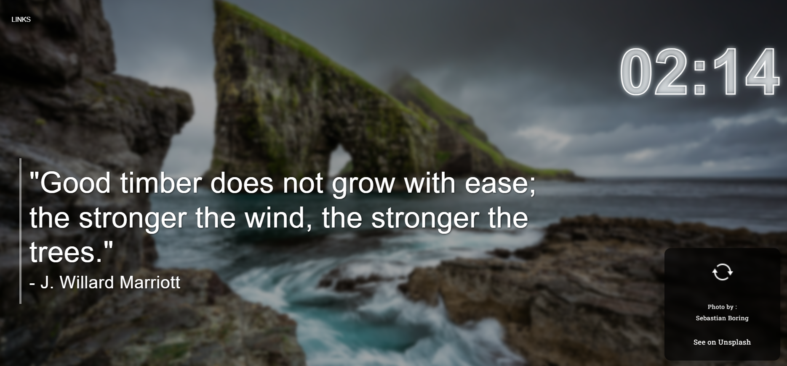
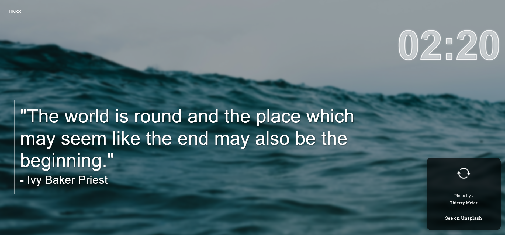
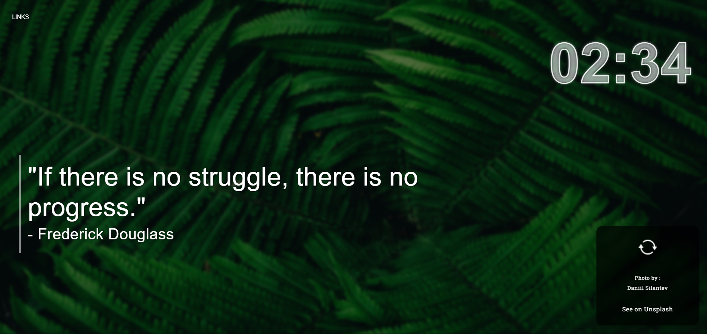

# 🌟 MindSpark – Daily Inspiration in Every Tab

**MindSpark** is a powerful and beautifully designed Chrome extension that brings daily motivational quotes from the world’s greatest minds right to your browser. Paired with visually uplifting images, it helps boost your productivity and mindset every time you open a new tab.

---

## 🚀 Features

- 🧠 **Daily Inspirational Quotes**
  - Curated from great thinkers, leaders, and change-makers.
  
- 🌄 **Beautiful Visuals**
  - Each quote is paired with stunning background imagery to elevate your mood.

- 📅 **Auto-Rotating Quotes**
  - Fresh new content every day, automatically.

- 🎯 **Minimal & Distraction-Free UI**
  - Designed to keep you focused and inspired, without clutter.

---

## 🛠 Installation

1. Download or clone this repository:
   ```bash
   git clone https://github.com/MALATHI-N79/MindSpark.git

2. Open Google Chrome and go to: chrome://extensions/

3. Enable Developer Mode (top-right toggle)

4. Click "Load unpacked" and select the mindspark-extension folder

5. Done! Now open a new tab and get inspired ✨

---

📸 Preview


---

---

---

🤝 Credits

Quotes from public domain sources

Images from Unsplash / Pexels

---

📜 License

MIT License © 2025 [Malathi N]

---

💡 Stay Inspired

“Dream is not that which you see while sleeping, it is something that does not let you sleep.”
— Dr. APJ Abdul Kalam

